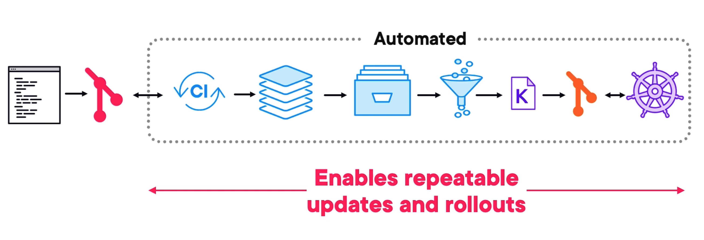

1. Fundamental Concepts
  - The Big Picture
  - Fixing Problems
  - Shared Kernels and VM Isolation
  - Linux vs. Windows vs. Mac
  - The Microservices Revolution
  - The Need for Orchestration
  - Important Standards and Specifications
  - High-level Workflow
    
2. Docker and Containers
  - Docker Inc vs docker
  - Docker Architecture
  - Docker Demo
3. Kubernetes and Orchestration
  - Kubernetes
  - The OS of the Cloud
  - Orchestration
  - Kubernetes Demo
  - GitOps Workflows